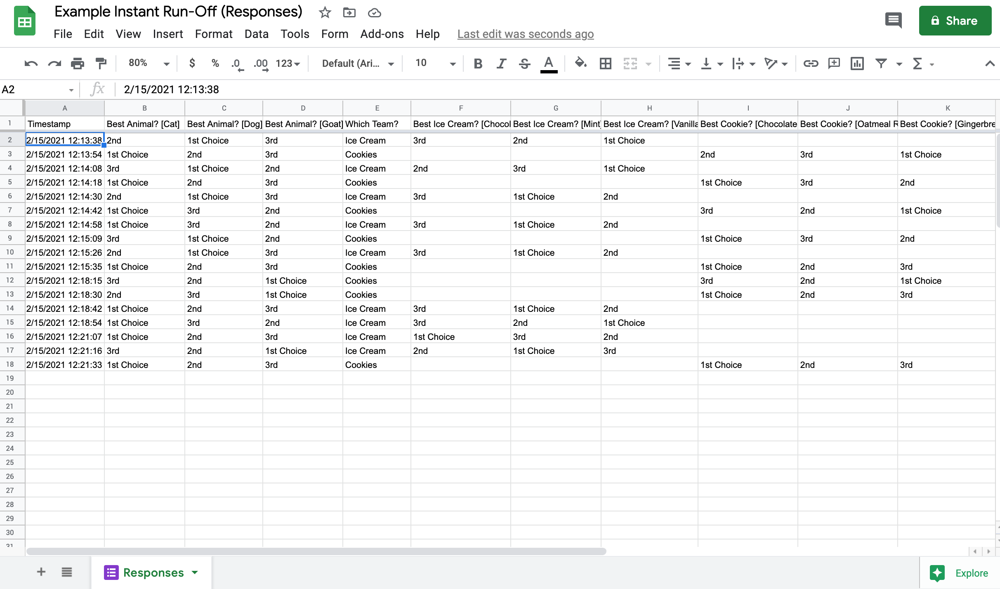
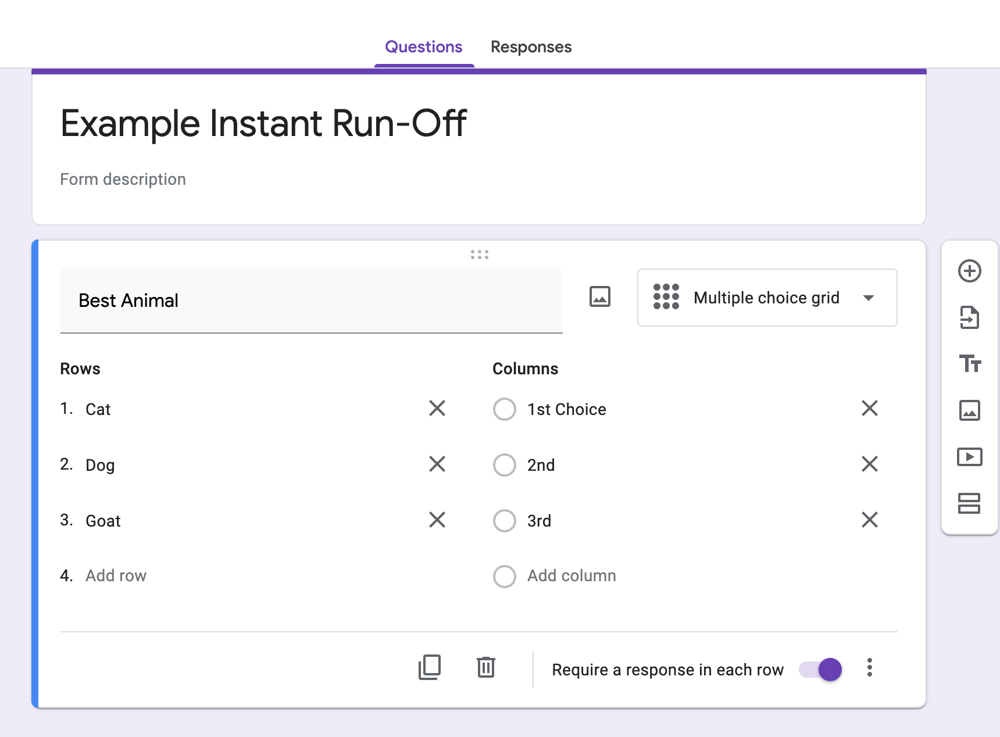

# README

Author: Jonah Eaton

based off work done by Chris Cartland in 2012-04-29 [Instant Runoff Voting](http://github.com/cartland/instant-runoff "IRV")

Updated to allow for multiple, mutli-stage instant-runoff questions that work with more user-friendly google forms
It is likely that the code for using keys in Chris Cartland's original code has been broken by my changes.  

# What is instant-runoff voting?

Wikipedia describes IRV very well. http://en.wikipedia.org/wiki/Instant-runoff_voting

In this project, IRV is a method of electing one winner. Voters rank candidates in a Google Form and the administrator runs a script with Google Apps Script to determine the winner.

## Instant-runoff voting from the voters perspective

1. You get one vote that counts. It comes from your top choice that is still eligible.
2. If a candidate gets a majority of votes, then that candidate wins.
3. If no candidate has majority of all votes, then the candidate with the least votes is removed.
4. If your top choice is removed, the next eligible candidate on your list gets a vote. The process repeats until there is a winner.

_Notes about algorithm_

* Majority means more than half of all votes. Example: candidate A gets 3 votes and candidates B, C, and D each get 1 vote. Candidate A does not have majority because 3 is not more than half of 6.
* If multiple candidates tie for least votes, then all are removed.
* It is possible that multiple candidates tie for first place, in which case the vote ends in a tie.

# Example
* [Example Spreadsheet](https://docs.google.com/spreadsheets/d/11bM4oySuRGeLi5jdxZ4p3awOjMDp4-6D2dvRzGrEGhE/edit?usp=sharing)
* [Example Form](https://forms.gle/ReTizBmeJ8ngrGpK8)

# Steps to run an election

Steps to run an election.
* Go to Google Drive. Create a new Google Form.
* Create questions according to instructions on GitHub -- https://github.com/jonaheaton/multipart-instant-runoff
* From the form spreadsheet go to "Tools" -> "Script Editor..."
* Copy the code from instant-runoff.gs into the editor.
* Configure settings in the editor and match the settings with the names of your sheets.
* From the form spreadsheet go to "Instant Runoff" -> "Setup".
    * If this is not an option, run the function setup_instant_runoff() directly from the Script Editor.
* Create keys in the sheet named "Keys".
* Send out the live form for voting. If you are using keys, don't forget to distribute unique secret keys to voters.
* From the form spreadsheet go to "Instant Runoff" -> "Run".
    * If this is not an option, run the function run_instant_runoff() directly from the Script Editor.

# How to administer example election

* Go to Google Drive. Create a new Google Form.

    * https://drive.google.com
    
* Create questions according to instructions on GitHub -- ()

**Edit Form**

Create a short title that tells voters what they are voting for. Use a description for additional explanation. 
Use the "Multiple Choice Grid" question type.
The rows are the different options that the voter will be ranking
The columns are the ranking numbers. Best practice is to use "1st Choice", "2nd", "3rd", etc
Important to select the following limits:
* "Limit to One Response per Column"
* "Shuffle Row Order"
Shuffling the row order will allow for unbaised selection (cite research that shows candidates at the top of a ballot get disproportionally more votes), and the limiting one response per column will make sure that the voter can only select one voter to be their second choice. In order to avoid likely bugs, best to also select the option "Require a Response in Each Row"

You can multiple and multi-stage questions. In the example form provided, voters select which team they want to be associated with, and are presented with a ranked-choice voting question associated with that team. 

**Add Script**

* From the form spreadsheet go to "Tools" -> "Script Editor..."
Go to the spreadsheet from the editor by clicking the dropdown "See responses" and clicking "Spreadsheet". "Tools" is on the top bar.
* Copy the code from instant-runoff.gs into the editor.
Save the project (may need to create a project name). 
* Configure settings in the editor and match the settings with the names of your sheets.
The settings in instant-runoff.gs should already match the example names in this README.
* From the form spreadsheet go to "Instant Runoff" -> "Setup".
    * If this is not an option, run the function setup_instant_runoff() directly from the Script Editor.
* Create keys in the sheet named "Keys".
    * A2, "secretkey1"
    * A3, "secretkey2"
    * A4, "secretkey3"
    * A5, "secretkey4"
    * A6, "secretkey5"

    *Add at least enough keys to accommodate each voter.

* Send out the live form for voting. If you are using keys, don't forget to distribute unique secret keys.
    * Find the live form under Form -> Go to live form.
* From the form spreadsheet go to "Instant Runoff" -> "Run".
    * If this is not an option, run the function run_instant_runoff() directly from the Script Editor.

# Settings

Found in [instant-runoff.gs](need to update link)

* VOTE\_SHEET\_NAME must match the name of sheet containing votes. "Sheet1" will work for unmodified form sheets. The example uses "Votes".
* BASE\_ROW defines which row to contains the first voting information. Set this to 2.
* BASE\_COLUMN is the column number for the first choice. In the example the first choice is in column C, so set this to 3.
* USING\_KEYS = true if you want to use keys. The example uses keys so this is set to true.
* VOTE\_SHEET\_KEYS\_COLUMN specifies which form column contains voter submitted keys in the VOTE_SHEET. In the example the secret keys are in column B, so set this to 2.
* KEYS\_SHEET\_NAME is the name of the sheet containing the master list of valid voting keys. The examples calls this "Keys".
* USED\_KEYS\_SHEET\_NAME is the name of the sheet where used keys are recorded. The example calls this "Used Keys".

# Global Variables

* NUM\_COLUMNS is the maximum number of choices. As of October 10, 2012, the software figures this out based on the first row of the voting sheet.
